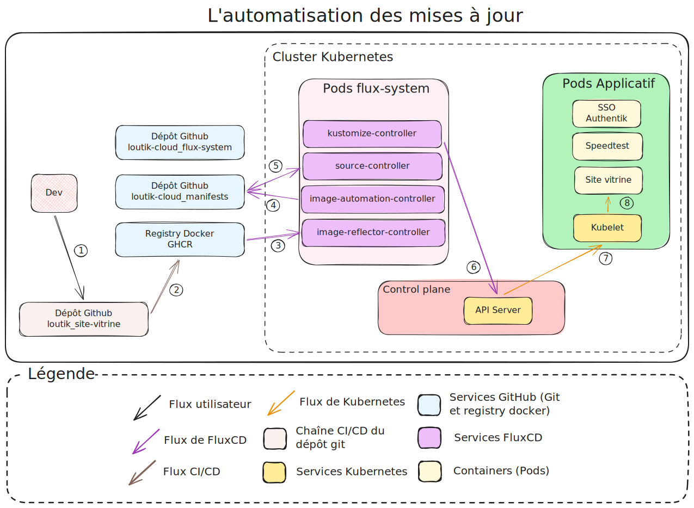
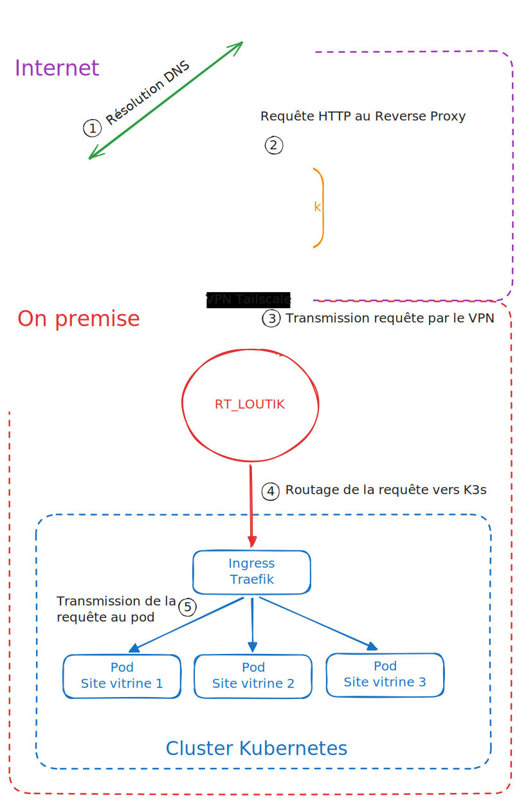

## A. La problématique de la gestion d'un cluster

Dans le cadre de mon projet personnel **LoutikCLOUD**, j'ai dû faire face à deux défis majeurs : comment gérer une infrastructure conteneurisée croissante sans tomber dans le piège de la "configuration manuelle" (le fameux *ClickOps*) ? Et surtout, comment restaurer rapidement une infrastructure complexe comme Kubernetes en cas de sinistre ?

{/* truncate */}

Avec la multiplication des services (site vitrine, bot Discord, outils de surveillance), la méthode traditionnelle consistant à appliquer des commandes `kubectl` manuellement présentait trois risques critiques :

1. **La dérive de configuration** : L'état réel du cluster finit par différer de ce que l'on pense avoir déployé.
2. **Un RTO (Recovery Time Objective) trop long** : En cas de panne, reconstruire l'infrastructure à la main prendrait un temps incompatible avec une exigence de service.
3. **L'absence de traçabilité** : Il devenait difficile de déterminer qui a modifié quoi, et quand.

Mon objectif était clair : migrer vers une architecture **GitOps** capable de garantir un RTO inférieur à 30 minutes grâce au redéploiement automatique, tout en séparant strictement la configuration de l'outil d'orchestration (FluxCD) de celle des applications métiers.

## B. Les choix techniques : Pourquoi K3s et FluxCD ?

Pour répondre à ces besoins, j'ai arrêté une stack technique précise, privilégiant la légèreté et l'automatisation native.

### 1. L'Orchestrateur : K3s

Plutôt qu'un cluster Kubernetes standard, souvent lourd en ressources, j'ai choisi **K3s**.

*   **Légèreté** : Idéal pour un environnement homelab ou *edge*.
*   **Simplification** : Remplacement de la base de données `etcd` par **SQLite** pour le Plan de Contrôle. C'est suffisant pour mon échelle et bien moins complexe à maintenir.
*   **Runtime** : Utilisation de **Containerd** directement intégré, sans la surcouche Docker devenue inutile pour Kubernetes.

### 2. L'approche GitOps : FluxCD

J'ai sélectionné FluxCD comme moteur de réconciliation, le préférant à des solutions comme ArgoCD pour plusieurs raisons stratégiques :

* **Légèreté et simplicité :** FluxCD ne possède pas d'interface graphique (UI). Bien que cela puisse sembler être un frein, c'est un atout majeur pour un homelab ou des environnements edge : l'outil est extrêmement gourmand en ressources, contrairement à ArgoCD qui nécessite plus de mémoire et de CPU pour faire tourner son serveur web et son interface.
- **Sécurité réseau (Approche Pull) :** FluxCD fonctionne exclusivement en mode Pull. C'est l'outil qui va chercher les changements sur GitHub, et non l'inverse.
    - **Conséquence directe :** Je n'ai aucun besoin de configurer des clés SSH ou des webhooks entrants depuis GitHub vers mon infrastructure. 
    - **Avantage :** Mon cluster reste totalement isolé derrière mon pare-feu. Aucune connexion entrante depuis Internet n'est nécessaire pour le déploiement, ce qui réduit considérablement la surface d'attaque.
- **Source de vérité unique :** Tout réside dans Git. Si le cluster dérive, FluxCD le corrige automatiquement.

### 3. L'Architecture Multi-Dépôts

Une décision structurante a été la séparation en deux dépôts Git distincts :

*   `loutik-cloud_k3s-flux-system` : Contient la configuration de FluxCD lui-même (les contrôleurs, les sources, les politiques). C'est le "chef d'orchestre".
*   `loutik-cloud_k3s-manifests` : Contient les applications métiers (Site vitrine, Bot Discord) et l'infrastructure réseau (Traefik). C'est la "partition musicale".

Cette séparation permet de modifier la logique d'automatisation sans risquer de corrompre les déploiements applicatifs, et vice-versa.

## C. Difficultés rencontrées et solutions apportées

Le chemin vers une infrastructure 100 % déclarative n'a pas été sans embûches. Voici les principaux obstacles techniques que j'ai dû surmonter.

### 1. La gestion des secrets

*   **Problème** : Le principe du GitOps impose que tout soit dans Git, mais il est hors de question de versionner des mots de passe ou des tokens en clair.
*   **Solution** : J'ai adopté une approche hybride sécurisée. Les secrets sensibles (tokens API, mots de passe BDD) sont stockés dans un coffre-fort **Bitwarden**. Ils sont injectés manuellement dans le cluster via `kubectl create secret` avant le déploiement. FluxCD fait ensuite le lien via des `secretRef` dans ses manifests, sans jamais voir la donnée sensible dans Git.
*   **Axe d'amélioration envisagé** : Intégrer une solution comme **HashiCorp Vault** pour centraliser et faire tourner les clés API et autres secrets de manière dynamique.

### 2. L'automatisation des mises à jour d'images (Image Update Automation)

*   **Problème** : Comment mettre à jour un conteneur quand une nouvelle image Docker est poussée sur le registre (GHCR) sans intervention humaine ?
*   **Solution** : J'ai déployé les modules **Image Reflector** et **Image Automation Controller** de FluxCD sur mon infrastructure.

Cependant, la configuration a été délicate. Il a fallu :

1.  Ajouter un marqueur spécifique (`{"$imagepolicy": "..."}`) dans les fichiers YAML de déploiement.
2.  Créer des politiques de versionnement sémantique (ex : accepter uniquement les versions `>=1.0.0`) pour éviter les ruptures de compatibilité.
3.  Appliquer ces politiques de versionnement sur toutes les chaînes CI/CD de l'infrastructure.
4.  Configurer un token Git avec droits d'écriture pour permettre à FluxCD de commiter automatiquement le nouveau tag de version dans le dépôt.

### 3. La sécurisation du Plan de Contrôle

> **Note technique** : Par défaut sur **K3s**, le *Control Plane* est également un nœud *worker* capable d'exécuter des pods clients.

*   **Problème** : Éviter que des applications utilisateur ne s'exécutent sur le nœud **Control Plane**, ce qui pourrait compromettre la stabilité du cœur du cluster.
*   **Solution** : Application de **Taints** (`CriticalAddonsOnly=true:NoExecute`) sur le nœud *Control Plane*. Seul le cœur de Kubernetes peut y tourner. Les charges de travail sont forcées vers les nœuds *Workers* via des labels et des tolérances.

## D. Résultat final

Aujourd'hui, l'infrastructure **LoutikCLOUD** fonctionne de manière autonome selon le principe de la boucle de réconciliation.

### 1. Le flux de déploiement

Lorsqu'un développeur modifie un fichier de configuration dans le dépôt de manifests :

1.  Le contrôleur **Source** de FluxCD détecte le nouveau commit sur GitHub.
2.  Le contrôleur **Kustomize** lit les fichiers, assemble les ressources (Namespace, Deployment, Ingress) et les soumet à l'API Server de Kubernetes.
3.  Le **Scheduler** place les Pods sur les Workers disponibles.
4.  Le **Kubelet** lance les conteneurs via Containerd.

*Schéma - Flux de déploiement sur K3s avec FluxCD*

### 2. Le flux de mise à jour automatique (Continuous Deployment)

Pour mon site vitrine et mes bots, le processus est entièrement automatisé :

1.  Je pousse du code sur le dépôt de l'application.
2.  La CI compile et pousse une nouvelle image Docker sur GHCR.
3.  L'**Image Reflector Controller** détecte la nouvelle version.
4.  L'**Image Automation Controller** met à jour le fichier YAML dans le dépôt Git et crée un commit automatique.
5.  La boucle GitOps standard se déclenche pour déployer la nouvelle version en production sans aucune intervention de ma part.

*Schéma - Flux CI/CD avec déploiement automatique des conteneurs Docker*

### 3. Exemple d'une requête utilisateur

Le trafic utilisateur arrive sur un VPS Infomaniak (Gateway), transite par un tunnel **Tailscale** sécurisé vers mon infrastructure locale, puis est routé par **Traefik** (Ingress Controller) qui effectue le Load Balancing vers les Pods actifs.

*Schéma - Requête utilisateur sur K3s - LoutikCLOUD*

## E. Conclusion

Ce projet m'a permis de passer d'une vision théorique de Kubernetes à une maîtrise opérationnelle d'une architecture de production. L'adoption de **FluxCD** et de la logique *Infrastructure as Code* a transformé ma gestion de l'homelab : fini les scripts Bash fragiles et les interventions d'urgence, place à la déclarativité et à l'auditabilité.

Cette architecture, bien que déployée dans un contexte personnel, reprend les standards observés en entreprise (séparation des rôles, gestion sécurisée des secrets, CI/CD automatisée). Elle constitue une base solide pour *scaler* vers des besoins plus complexes, comme le multi-clustering ou la gestion de politiques de sécurité avancées (OPA/Gatekeeper).

Le code source de cette infrastructure est disponible sur mon GitHub et mes fiches de procédures détaillées sont consultables sur mon site de documentation :

*   📄 [Procédure d'installation de FluxCD sur K3s](https://docs.loutik.fr/docs/homelab/infra-core/orchestrateur/fluxcd/PROC_Installation-fluxcd-k3s)
*   🗺️ [Cartographie et fonctionnement du cluster](https://docs.loutik.fr/docs/homelab/architecture/cartographie/SAO_Fonctionnement-cluster-k3s)
*   💻 [Dépôt des Manifests (Applications)](https://github.com/FireToak/loutik-cloud_k3s-manifests)
*   ⚙️ [Dépôt du Système FluxCD](https://github.com/FireToak/loutik-cloud_k3s-flux-system)