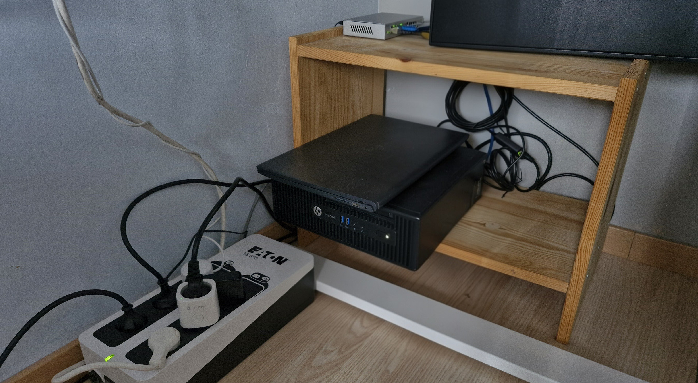

---

## 🎯 Vision & Philosophie

Ce projet a pour but de simuler un **environnement de production hybride et résilient** dans un contexte domestique. L'infrastructure repose sur une architecture en double cluster :

1.  **Cluster de Virtualisation (Proxmox VE) :** Assure la gestion des machines virtuelles et la haute disponibilité (HA) au niveau infrastructure.
2.  **Cluster d'Orchestration (K3s) :** Assure le déploiement et le scaling des applications conteneurisées.

Au-delà de l'aspect technique, cette démarche répond à une volonté de **souveraineté numérique** : reprendre le contrôle sur mes données et mes outils. C'est également un vecteur d'apprentissage ludique qui force à comprendre les couches basses et le fonctionnement interne des applications, souvent masqués par les solutions SaaS ("Under the hood").

L'infrastructure est conçue avec une approche **"Production-First"** :
* **Stabilité :** Capacité à subir un redémarrage à froid complet sans intervention humaine.
* **Résilience :** Objectif de RTO (*Recovery Time Objective*) inférieur à **1 heure** en cas de perte critique (via Backups & IaC).
* **Service :** Hébergement réel pour des tiers (Bot Discord de la classe BTS SIO, services familiaux).

---

## ⚙️ Inventaire Matériel (Compute)

L'infrastructure physique supporte le **Cluster Proxmox** composé de deux nœuds hétérogènes, optimisés pour le rapport performance/consommation.

*Vue d'ensemble du matériel (Dell Inspiron & HP ProDesk)*

### Node 01 : Dell Inspiron 15 (Laptop)
Ce nœud profite de la batterie intégrée du PC portable comme onduleur (UPS) naturel.

| Composant | Spécifications | Rôle dans le Cluster |
| :--- | :--- | :--- |
| **CPU** | AMD Ryzen 5 5500U (6c/12t) | Worker K3s & VMs |
| **RAM** | 16 GB DDR4 | Allocation dynamique |
| **Stockage** | 120 GB NVMe (OS) + 500 GB HDD | Système & Stockage froid |
| **Réseau** | Carte USB 2.5 GbE | Corosync & Migration |

### Node 02 : HP ProDesk 400 G3 (Mini-PC)
Le nœud principal pour la virtualisation lourde grâce à sa capacité mémoire. Il est sécurisé électriquement par un onduleur dédié.

| Composant | Spécifications | Rôle dans le Cluster |
| :--- | :--- | :--- |
| **CPU** | Intel Core i5 6500 (4c/4t) | Master K3s & Core Infra |
| **RAM** | 32 GB DDR4 | Infrastructure Core |
| **Stockage** | 120 GB NVMe (OS) + 500 GB HDD | Système & Stockage chaud |
| **Réseau** | 1 GbE (Intégré) + 2.5 GbE (Extension) | WAN & Liaison Cluster |
| **Alim.** | **Onduleur Eaton** | Protection électrique & Shutdown propre |

---

## 🚧 Contexte & Contraintes

L'architecture a été dictée par des contraintes environnementales strictes, forçant l'usage de solutions techniques adaptées (Architecture Edge).

* **Réseau (CGNAT / IP Dynamique) :** Absence d'IP publique fixe.
    * *Solution :* Mise en place d'un VPS "Passerelle" chez Infomaniak avec tunnel VPN (Tailscale) pour l'exposition.
* **Environnement Physique :** Hébergement en chambre.
    * *Contrainte :* Silence absolu requis et dégagement thermique faible.
* **Consommation Énergétique :**
    * *Budget :* ~40W/h en charge moyenne pour l'ensemble du cluster. Choix de matériel mobile/USFF (*Ultra Small Form Factor*).

---

## 👥 Bénéficiaires & Services

L'infrastructure n'est pas un simple laboratoire de test éphémère, elle rend des services réels :

* **Personnel :** Laboratoire d'apprentissage SRE, tests de déploiement Kubernetes.
* **Famille :** Services multimédia et stockage privé (Nextcloud, Plex/Jellyfin).
* **Communautaire (BTS SIO) :** Hébergement du Bot Discord de la classe et projets étudiants tiers.