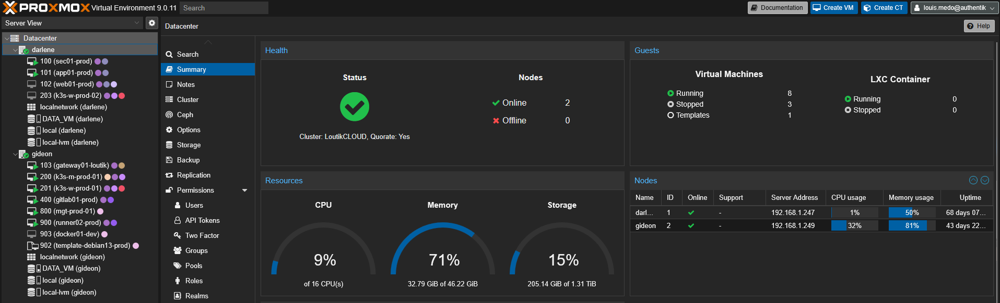
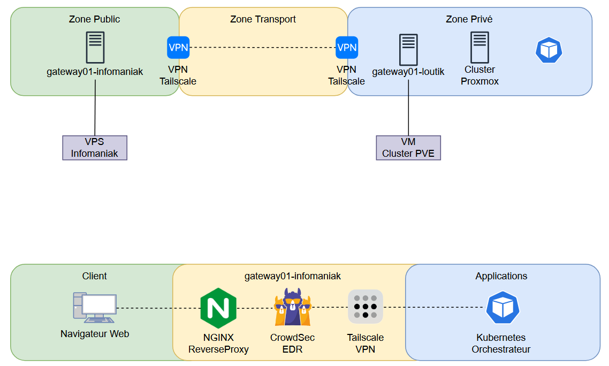

# Introduction au Socle Physique & Réseau

Cette section détaille la mise en place des fondations du projet **LoutikCLOUD**. L'objectif est de déployer une infrastructure résiliente, sécurisée et capable d'héberger les futures applications conteneurisées.

Ce que nous allons voir ici :
1.  **Le Socle Physique & Réseau** : L'interconnexion des serveurs (Proxmox) et du point d'entrée (VPS).
2.  **Les Services Core** : Les outils transverses indispensables comme GitLab.

Cette partie couvre l'installation du matériel ("Bare Metal"), la virtualisation, ainsi que la configuration réseau de base.

## 1. Infrastructure de Virtualisation (Proxmox VE)

Pour assurer la disponibilité des services et préparer la haute disponibilité, j'ai opté pour un cluster de virtualisation composé de deux nœuds physiques interconnectés:

* **Hyperviseur 1** : `PVE-DARLENE`
* **Hyperviseur 2** : `PVE-GIDEON`

**Mon approche :**
J'ai configuré ces hyperviseurs avec des IP statiques et créé un Cluster Proxmox pour centraliser la gestion. Cette architecture me permet de préparer le terrain pour la réplication des données (ZFS) et la migration à chaud des VMs.

---

## 2. La Gateway : Un "Cloudflare Tunnel" fait maison

L'exposition directe de mes hyperviseurs ou de ma box internet sur le web étant une faille de sécurité critique, j'ai conçu une architecture basée sur un **VPS Gateway**.

:::info Le Concept "DIY"
Mon objectif était de reproduire le fonctionnement d'un **Cloudflare Tunnel**, mais de manière entièrement auto-hébergée avec des outils Open Source.
:::

Cette architecture repose sur trois piliers:

1.  **Le Masquage d'IP** : Le VPS agit comme un bouclier. C'est sa seule IP qui est publique. L'adresse IP résidentielle de mon FAI reste totalement invisible, rendant les attaques DDoS ou les tentatives d'intrusion directes beaucoup plus difficiles.
2.  **Le Tunnel Chiffré** : L'interconnexion entre le VPS (Public) et le Cluster Proxmox (Privé) est assurée par un maillage VPN **Tailscale**. Le VPS ne "voit" les serveurs que via leurs IP VPN (100.x.y.z).
3.  **La Sécurité Active** : Le VPS embarque **Nginx** en Reverse Proxy couplé à **Crowdsec**. Ce dernier analyse les logs en temps réel et bannit les IP malveillantes avant même qu'elles n'entrent dans le tunnel.

---

## 3. Les Services "Core"

Avant de déployer des applications clients (Kubernetes), j'ai besoin d'une forge logicielle stable pour gérer mon code et mes configurations.

* **GitLab CE** : J'ai déployé GitLab directement dans une VM dédiée sur `PVE-GIDEON` (hors du futur cluster Kubernetes). Cela garantit que le code source et les pipelines CI/CD restent accessibles même si le cluster applicatif rencontre un problème critique.
* **Automatisation** : J'utilise des templates **Cloud-init** (Debian 13) et **Ansible** pour standardiser et accélérer le déploiement de mes futures machines virtuelles.