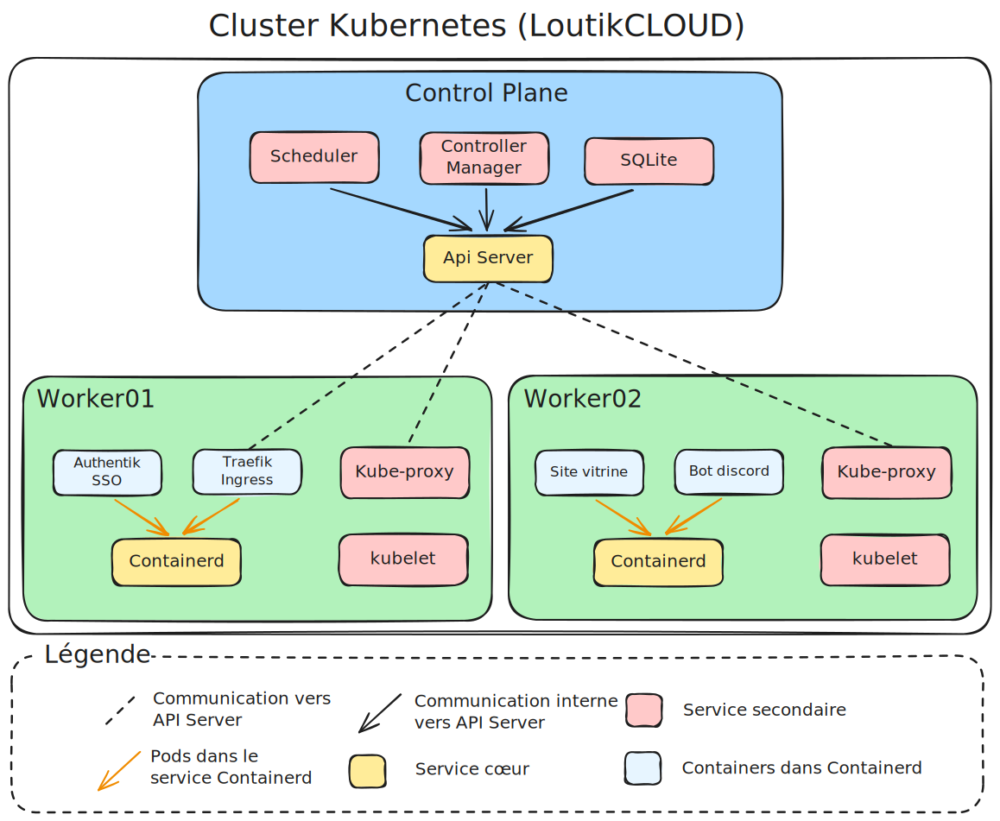
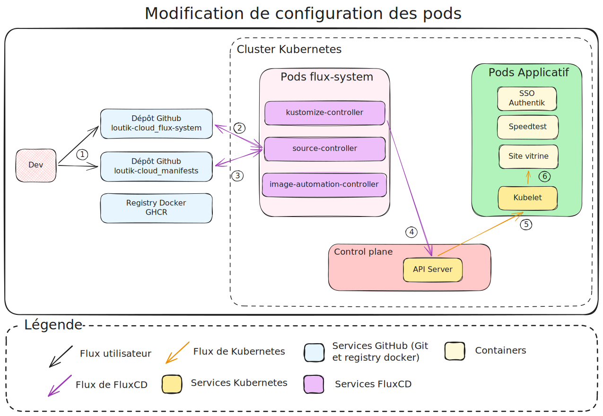

# SAO - Fonctionnement de l'infrastructure Kubernetes chez LoutikCLOUD

---
## Informations

- **Mainteneur :** MEDO Louis
- **Date de dernière édition :** 05/03/2026

---
## A. Contexte

Suite à l'augmentation des services conteneurisés hébergés, nous avons décidé de migrer vers un orchestrateur de conteneurs. L'objectif est de garantir un RTO[^2] inférieur à 30 minutes grâce au redéploiement automatique géré par l'outil FluxCD. Ce document explique comment les composants de notre architecture Kubernetes communiquent entre eux, en s'appuyant sur l'exemple d'une requête utilisateur ciblant un service sur l'orchestrateur.

---
## B. Architecture logique de Kubernetes

Le schéma ci-dessous présente l'architecture logique du cluster Kubernetes déployé sur l'infrastructure LoutikCLOUD. Cette vue statique met en évidence la séparation fondamentale entre le Plan de Contrôle (Control Plane), responsable de la gestion et de la prise de décision, et le Plan de Données (Data Plane), composé des nœuds travailleurs exécutant les charges de travail.

*Schéma logique - Infrastructure K3s LoutikCLOUD*

#### 1. Le "Control Plane"

Situé en haut du schéma, le **Control Plane** agit comme le « cerveau » du cluster. Dans notre implémentation K3s, l'architecture est optimisée pour la légèreté tout en conservant les composants standards de Kubernetes :

- **API Server (`kube-apiserver`) :** C'est le composant central et l'unique porte d'entrée pour toutes les communications. Il expose l'API Kubernetes et valide les requêtes. Comme illustré par les flèches pointillées, tous les autres composants (Kubelet, FluxCD, Traefik) communiquent exclusivement avec lui, garantissant une source de vérité unique.
- **Scheduler (`kube-scheduler`) :** Il surveille les nouveaux Pods créés et décide sur quel nœud travailleur ils doivent être placés, en fonction des ressources disponibles et des contraintes définies.
- **Controller Manager (`kube-controller-manager`) :** Il exécute les processus de contrôle qui régulent l'état du cluster (par exemple, s'assurer que le nombre de réplicas d'un déploiement correspond à la réalité).
- **Datastore (SQLite) :** Contrairement à un cluster Kubernetes standard qui utilise `etcd`, K3s utilise par défaut SQLite pour stocker l'état du cluster.

#### 2. Les "Worker Nodes"

En bas du schéma, les nœuds **Worker01** et **Worker02** constituent la force d'exécution du cluster. Ils hébergent les applications réelles et les services réseau nécessaires à leur fonctionnement. Chaque nœud intègre :

- **Kubelet :** L'agent principal qui s'exécute sur chaque nœud. Il maintient un canal de communication permanent avec l'API Server (flèches pointillées) pour recevoir les ordres de déploiement et rapporter l'état de santé du nœud.
- **Kube-proxy :** Ce composant gère les règles de réseau au niveau du nœud, permettant la communication interne et externe vers les Services Kubernetes via IPTables ou IPVS.
- **Containerd :** C'est le moteur de conteneurisation (runtime) utilisé par K3s. Il est responsable du téléchargement des images et de l'exécution effective des conteneurs. Les flèches oranges illustrent que tous les Pods (applications et services) tournent au sein de ce moteur.

#### 3. Répartition des charges de travail

Une attention particulière a été portée à la localisation des services pour garantir la stabilité et la sécurité :

- **Services d'Infrastructure (Traefik, FluxCD) :** Bien que critiques, ces composants sont déployés sous forme de Pods sur les Workers et non sur le **Control Plane**. Cela isole le trafic réseau (Ingress) et les processus de déploiement continu (GitOps) du cœur de gestion du cluster.
    - **Traefik Ingress :** Agit comme point d'entrée du trafic utilisateur. Il interroge l'API Server pour connaître la topologie du réseau et router les requêtes vers les bons Pods.
    - **FluxCD :** Opère la boucle de réconciliation GitOps en surveillant les dépôts Git et en appliquant les configurations via l'API Server.
- **Applications Métier :** Les services tels que _Authentik SSO_, _Site vitrine_, _Bot discord_ et _Speedtest_ sont répartis sur les différents nœuds selon les décisions du Scheduler, démontrant la capacité de l'infrastructure à orchestrer des charges de travail hétérogènes.

---
## C. Flux de déploiement (GitOps)

Les schémas ci-dessous représentent le fonctionnement GitOps de l'infrastructure LoutikCLOUD via FluxCD.

### 1. Modification de configuration des pods

*Schéma - Modification de configuration des pods*

Ce flux illustre la boucle de réconciliation standard lorsqu'un fichier manifeste est modifié :

- **1.** Le développeur pousse ses modifications sur les dépôts GitHub d'infrastructure.
- **2 & 3.** Le composant `source-controller` de FluxCD télécharge régulièrement l'état de ces dépôts.
- **4.** Le `kustomize-controller` lit ces nouveaux fichiers et transmet la configuration à l'**API Server** du Control Plane.
- **5.** L'API Server communique avec le **Kubelet** du nœud (Worker) concerné.
- **6.** Le Kubelet interagit avec le moteur de conteneurisation (**containerd**) pour appliquer les modifications au Pod cible.

### 2. L'automatisation des mises à jour

*Schéma - L'automatisation des mises à jour*

Ce flux détaille la mise à jour automatique d'une application sans intervention humaine :

- **1.** Le développeur pousse une mise à jour du code de l'application (ex: `site-vitrine`).
- **2.** La chaîne d'intégration continue (CI) compile et pousse la nouvelle image Docker sur le registre **GHCR**.
- **3.** L'`image-reflector-controller` détecte l'apparition de cette nouvelle image sur le registre.
- **4.** L'`image-automation-controller` modifie le fichier YAML dans le dépôt de manifestes pour y inscrire la nouvelle version, et crée un _commit_ automatiquement.
- **5 & 6.** Le dépôt ayant été modifié, la boucle GitOps standard s'enclenche : le `source-controller` récupère la mise à jour, et le `kustomize-controller` l'envoie à l'API Server.
- **7 & 8.** L'API Server ordonne au Kubelet de déployer la nouvelle version du conteneur *Site vitrine.*

---
## D. Cheminement d'une requête HTTP utilisateur.

Cette partie détaille le cheminement réseau d'une requête HTTP, depuis le navigateur de l'utilisateur jusqu'au service conteneurisé au sein du cluster Kubernetes.

*Schéma - Flux de donnée sur l'infrastructure LoutikCLOUD*

Le flux se décompose en 5 grandes étapes traversant différentes zones réseau :

- **1. Résolution DNS (Zone Internet) :** Le navigateur de l'utilisateur interroge le serveur DNS du domaine `loutik.fr` pour résoudre l'adresse IP publique cible.

- **2. Point d'entrée public (Entrypoint) :** La requête HTTP atteint le VPS externe (`gateway01-infomaniak`). Ce serveur agit comme un _Reverse Proxy_ frontal pour réceptionner le trafic de manière sécurisée.

- **3. Tunnel sécurisé (VPN Tailscale) :** Pour ne pas exposer le réseau local sur Internet, le VPS transmet la requête de manière chiffrée via le réseau privé virtuel (Tailscale).

- **4. Routage local (Zone On-premise) :** Le routeur pare-feu physique de l'infrastructure (`RT_LOUTIK`) réceptionne le paquet entrant du tunnel VPN et le route (niveau L3) vers le cluster K3s.

- **5. Routage Ingress et Load Balancing (Zone Kubernetes) :** Le trafic entre dans le cluster via le contrôleur Ingress (Traefik). Ce dernier analyse la requête HTTP (niveau L7) et effectue une répartition de charge (_Load Balancing_) en transmettant la requête à l'un des Pods « Site vitrine » disponibles.