---

* **Auteur :** Louis MEDO
* **Date de mise à jour :** 30/11/2025

---

## 1. Topologie par Zones

Ce schéma illustre la segmentation du réseau en trois zones distinctes : **Publique** (VPS), **Transport** (VPN) et **Privée** (Homelab).

```mermaid
graph LR
    classDef public fill:#e1f5fe,stroke:#01579b,stroke-width:2px,color:#000000;
    classDef transport fill:#fff9c4,stroke:#fbc02d,stroke-width:2px,color:#000000;
    classDef prive fill:#e8f5e9,stroke:#2e7d32,stroke-width:2px,color:#000000;
    classDef device fill:#ffffff,stroke:#333,stroke-width:1px,color:#000000;

    subgraph Zone_Public ["☁️ Zone Publique"]
        direction TB
        VPS("🖥️ gateway01-infomaniak<br/>(VPS Infomaniak)"):::device
    end

    subgraph Zone_Transport ["🔒 Zone Transport"]
        VPN_L("🔵 VPN Endpoint"):::device
        Link[". . . Tunnel Tailscale . . ."]
        VPN_R("🔵 VPN Endpoint"):::device
    end

    subgraph Zone_Prive ["🏠 Zone Privée (On-Premise)"]
        direction TB
        GW_Local("🖥️ gateway01-loutik<br/>(VM Cluster PVE)"):::device
        Cluster("📦 Cluster Proxmox"):::device
    end

    %% Connexions
    VPS --- VPN_L
    VPN_L --- Link --- VPN_R
    VPN_R --- GW_Local
    GW_Local --- Cluster

    %% Application des classes aux zones (subgraphs)
    class Zone_Public public;
    class Zone_Transport transport;
    class Zone_Prive prive;
```

### Détails des Zones

* **Zone Publique :** Hébergée chez Infomaniak. C'est le seul point d'exposition direct à Internet.
* **Zone Transport :** Assurée par **Tailscale** (Mesh VPN), garantissant un lien chiffré au travers d'Internet.
* **Zone Privée :** Infrastructure locale (Proxmox) hébergeant les services critiques, invisible depuis l'extérieur sans passer par la Gateway.

---

## 2. Flux Applicatif (Requête Client)

Ce schéma détaille le trajet d'une requête HTTP d'un utilisateur jusqu'à l'application finale (Kubernetes).

```mermaid
graph LR
    %% Nœuds
    Client(👤 Client / Navigateur)
    
    subgraph VPS ["☁️ gateway01-infomaniak"]
        Nginx(🟩 NGINX<br/>Reverse Proxy)
        Crowdsec(🛡️ CrowdSec<br/>EDR / IPS)
        TS_VPS(🕸️ Tailscale<br/>Interface)
    end

    subgraph Home ["🏠 On-Premise"]
        K8s(☸️ Kubernetes<br/>Orchestrateur)
    end

    %% Flux
    Client -->|HTTPS| Nginx
    Nginx -->|Filtrage| Crowdsec
    Crowdsec -->|Flux Autorisé| TS_VPS
    TS_VPS -.->|Tunnel VPN| K8s

    %% Styles
    style VPS fill:#e1f5fe,stroke:#01579b,color:#000000
    style Home fill:#e8f5e9,stroke:#2e7d32,color:#000000
    style Nginx fill:#fff,stroke:#009688,stroke-width:2px,color:#000000
    style Crowdsec fill:#fff,stroke:#7b1fa2,stroke-width:2px,color:#000000

```

### Fonctionnement du flux

1. **Entrée :** Le client interroge `mon-site.fr` (IP du VPS).
2. **Proxy :** **NGINX** reçoit la requête.
3. **Sécurité :** **CrowdSec** analyse l'IP. Si elle est malveillante, la connexion est coupée (Drop).
4. **Transport :** Si validée, la requête est encapsulée dans le VPN **Tailscale**.
5. **Destination :** Le trafic arrive sur le cluster **Kubernetes** local qui sert l'application.

:::tip Note technique
Ce design permet de cacher l'IP publique de mon domicile. En cas d'attaque DDoS sur le VPS, l'infrastructure à la maison reste protégée et accessible en local.
:::