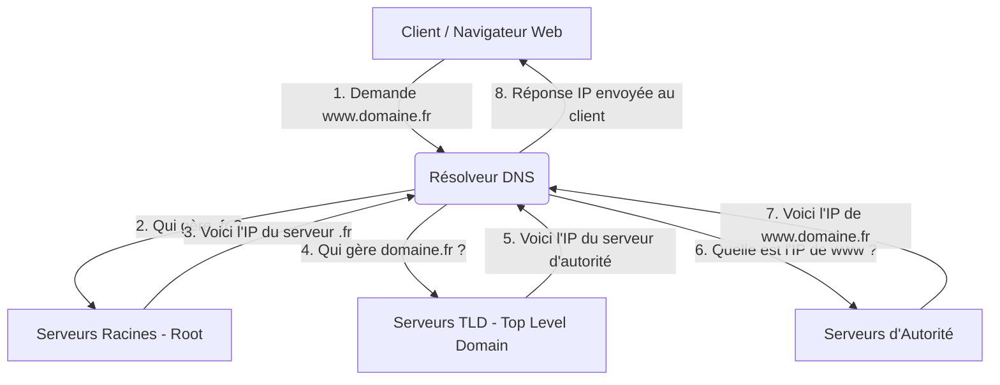

## Présentation du DNS

Le DNS (Domain Name System) agit comme l'annuaire téléphonique d'Internet. Il traduit les noms de domaine compréhensibles par l'homme (comme `google.fr`) en adresses IP compréhensibles par les machines (comme `142.250.179.99`), permettant ainsi le routage des paquets sur le réseau.

L'organisme principal qui supervise la gestion mondiale des noms de domaine est l'**ICANN** (Internet Corporation for Assigned Names and Numbers). Elle coordonne l'attribution des identifiants uniques (IP et domaines) et délègue la gestion des extensions (comme le `.fr`) à des registres spécifiques (comme l'AFNIC en France).

Dans les réseaux actuels, le DNS est une infrastructure critique. Sans lui, la navigation web, l'envoi d'e-mails et la connexion à tout service réseau nécessiteraient de mémoriser et de saisir manuellement des suites complexes de nombres (adresses IPv4 et IPv6). Il apporte flexibilité et tolérance aux pannes en permettant de changer l'adresse IP d'un serveur sans modifier son nom d'accès.

## Notions importantes à savoir

* **Zone DNS :** Espace administratif de l'arborescence DNS délégué à une entité ou un serveur spécifique pour la gestion de ses enregistrements.
* **FQDN (Fully Qualified Domain Name) :** Nom de domaine absolu, terminé par un point (ex: `www.loutikcloud.fr.`), spécifiant sa position exacte dans la hiérarchie.
* **TTL (Time To Live) :** Durée (en secondes) pendant laquelle une réponse DNS peut être conservée en cache par un résolveur avant de devoir être actualisée.

**Principaux types d'enregistrements (Records) :**

* **A :** Associe un nom d'hôte à une adresse IPv4.
* **AAAA :** Associe un nom d'hôte à une adresse IPv6.
* **CNAME (Canonical Name) :** Crée un alias qui pointe vers un autre nom de domaine, évitant la duplication d'adresses IP.
* **MX (Mail eXchange) :** Indique le serveur chargé de recevoir les e-mails pour ce domaine.
* **NS (Name Server) :** Définit les serveurs DNS qui font autorité pour la zone (ceux qui détiennent les fichiers de configuration officiels).
* **TXT :** Contient du texte brut, aujourd'hui massivement utilisé pour valider la propriété du domaine et sécuriser les e-mails (SPF, DKIM, DMARC).

## Fonctionnement du DNS

Pour résoudre un nom de domaine en adresse IP, le protocole DNS ne s'appuie pas sur un serveur unique, mais sur une architecture hiérarchique et distribuée. Le processus utilise différentes couches de serveurs qui communiquent entre elles en "entonnoir" pour affiner la recherche jusqu'à trouver l'information exacte.

* **Le Résolveur DNS :** C'est le serveur (souvent fourni par le FAI ou configuré en local comme Unbound) qui reçoit la requête de votre machine. Il se charge de faire le travail de recherche de manière récursive en interrogeant les couches supérieures.
* **Les Serveurs Racines (Root Servers) :** Ils constituent le sommet de la hiérarchie mondiale. Ils ne connaissent pas les adresses IP des sites, mais savent vers quels serveurs diriger la requête en fonction de l'extension (le point final virtuel `.`).
* **Les Serveurs TLD (Top Level Domain) :** Gèrent une extension spécifique (comme `.com`, `.fr`, `.org`). Ils connaissent les serveurs DNS d'autorité enregistrés pour chaque domaine sous leur extension.
* **Les Serveurs d'Autorité :** C'est le dernier maillon. Ils hébergent officiellement la zone DNS du domaine demandé et fournissent la réponse finale (l'enregistrement A ou CNAME) au résolveur.

## Exemple concret

Prenons l'exemple de l'achat et de la configuration du nom de domaine `loutikcloud.fr`.

1. **L'achat :** Vous achetez `loutikcloud.fr` chez un registraire (comme OVH ou Cloudflare). Le registraire informe l'AFNIC (qui gère le TLD `.fr`) que ce domaine vous appartient et lui transmet l'adresse de vos **Serveurs d'Autorité** (les serveurs NS du registraire).
2. **La configuration :** Sur l'interface du registraire, vous accédez à la zone DNS de `loutikcloud.fr`. Vous devez y créer un enregistrement de type **A**. Vous nommez cet enregistrement `web` et vous lui associez l'adresse IP publique de votre routeur.
3. **L'utilisation :** Un client tape `web.loutikcloud.fr` dans son navigateur.
4. **La requête en coulisses :**
* Le résolveur du client interroge un serveur racine, qui le renvoie vers les serveurs du `.fr`.
* Le serveur du `.fr` indique au résolveur que les serveurs d'autorité pour `loutikcloud.fr` sont chez OVH.
* Le résolveur interroge le serveur d'autorité d'OVH, qui lui renvoie l'adresse IP publique configurée à l'étape 2. Le navigateur peut alors afficher votre page.