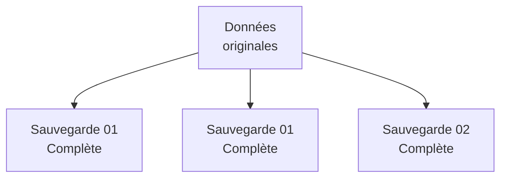
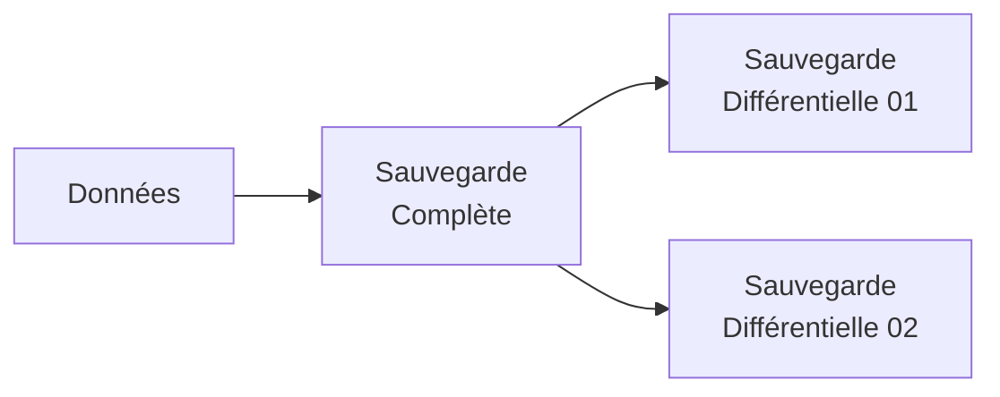

---
## Présentation de la problématique

La mise en place d'une stratégie de sauvegarde est cruciale pour pouvoir restaurer les serveurs virtuels et les applications rapidement en cas de sinistre majeur ou d'attaque par ransomware. L'enjeu principal est de garantir la continuité d'activité de l'entreprise tout en respectant les bonnes pratiques, la volumétrie des données, et en mobilisant les équipements adéquats.

## Les solutions

| **Solution / Méthode**        | **Avantages**                                                                               | **Inconvénients**                                                                                                 | **Cas d'usage type**                                 |
| ----------------------------- | ------------------------------------------------------------------------------------------- | ----------------------------------------------------------------------------------------------------------------- | ---------------------------------------------------- |
| **Sauvegarde Complète**       | Restauration simple, rapide et autonome.                                                    | Très gourmande en espace de stockage et très longue à exécuter.                                                   | Sauvegarde de base réalisée tous les mois.           |
| **Sauvegarde Incrémentielle** | Sauvegarde très rapide, économise l'espace de stockage et la bande passante.                | Restauration plus complexe (nécessite la sauvegarde complète initiale plus toutes les incrémentielles suivantes). | Sauvegarde quotidienne effectuée toutes les nuits.   |
| **Sauvegarde Immuable**       | Protège efficacement les données contre le chiffrement ou la suppression par un ransomware. | Espace de stockage verrouillé et inaltérable pour une durée fixe.                                                 | Sécurisation critique des sauvegardes de production. |

## Les concepts

### Les méthodes de sauvegarde

Il existe plusieurs approches mathématiques pour copier les données au fil du temps :

- **La sauvegarde complète (Full) :** Elle copie l'intégralité des données sélectionnées à un instant précis.

*Schéma de fonctionnement de la sauvegarde complète.*

- **La sauvegarde incrémentielle :** Elle ne sauvegarde que les données qui ont été modifiées depuis la _dernière_ sauvegarde effectuée (qu'elle soit complète ou incrémentielle).

*Schéma de fonctionnement de la sauvegarde incrémentielle.*

- **La sauvegarde différentielle :** Elle sauvegarde les données modifiées uniquement depuis la dernière sauvegarde _complète_.

*Schéma de fonctionnement de la sauvegarde différentielle*

### La règle d'or du 3-2-1

Il s'agit de la norme standard en administration système pour sécuriser les données face à tout type de perte. Elle se décompose ainsi :

- **3** : Conserver trois copies des données au total (les données de production + deux sauvegardes).
- **2** : Utiliser deux supports de stockage distincts (par exemple, un serveur dédié aux sauvegardes et un NAS).
- **1** : Garder une sauvegarde hors ligne ou externalisée (par exemple, des bandes magnétiques stockées dans un coffre-fort ou un NAS placé dans un autre bâtiment).

### Les équipements matériels

Pour soutenir cette stratégie et gérer des volumétries importantes (ex: 80 To), plusieurs équipements réseaux et de stockage sont nécessaires:

- **Serveur de sauvegarde dédié :** Un serveur physique équipé d'un logiciel spécialisé (comme Veeam Backup ou Proxmox Backup Server) pour orchestrer et centraliser les tâches de sauvegarde.
- **NAS (Network Attached Storage) :** Une baie de disques intelligente connectée au réseau (idéalement en 10 Gbits ou SFP+) permettant le stockage des réplicas, souvent placée dans un local distant pour éviter les destructions physiques simultanées.
- **Lecteur de bande magnétique (LTO) :** Permet une sauvegarde physique totalement déconnectée du réseau (Air-Gap). C'est le dernier rempart indispensable contre les ransomwares.

## Conclusion

Une stratégie de sauvegarde pertinente et moderne s'appuie sur la combinaison de sauvegardes complètes régulières et d'incrémentielles fréquentes pour optimiser l'espace. Le respect strict de la règle du 3-2-1, couplé à des technologies de sauvegardes immuables et à des supports physiques hors ligne comme les bandes magnétiques, offre la meilleure résilience possible face aux sinistres et aux cyberattaques.