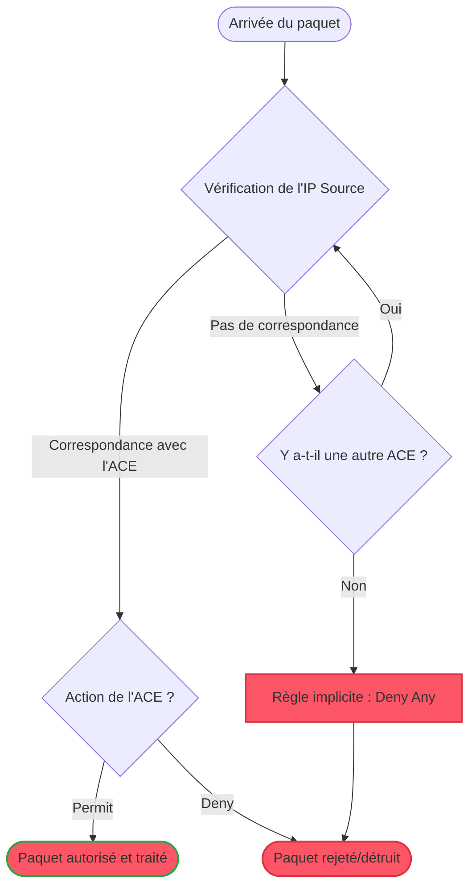
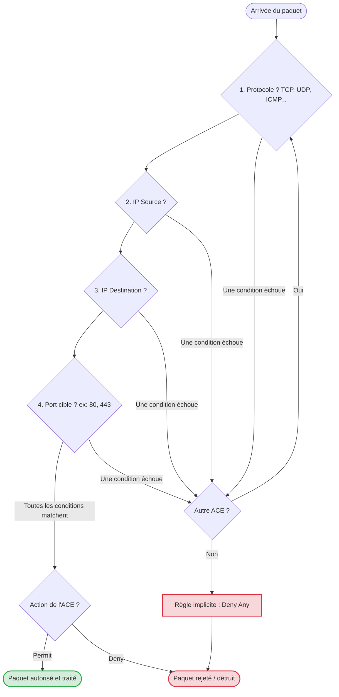

## Présentation des ACL

Une **ACL (Access Control List)** est une liste séquentielle d'instructions, appelées **ACE** (*Access Control Entries*). Appliquée sur l'interface d'un équipement de niveau 3 (comme un routeur), elle analyse les paquets entrants ou sortants pour décider de leur sort.

**Objectif :** Assurer la sécurité de base du réseau en filtrant le trafic selon des critères définis (filtrage de paquets sans état).

> ⚠️ **Bonne pratique :** Toute ACL se termine par une règle implicite de rejet global (*Implicit Deny Any*). Si un paquet ne correspond à aucune règle explicite définie, il est silencieusement détruit.

---
## Les deux types d'ACL : Pertinence et Cas d'usage

Le choix entre une ACL Standard et Étendue dépend directement de la granularité de sécurité souhaitée.

### 1. Les ACL Standards (Numérotées de 1 à 99)
Elles filtrent **uniquement en fonction de l'adresse IP source**.
* **Pertinence :** Utiles pour des actions globales. Elles servent à autoriser ou bloquer un hôte spécifique ou un sous-réseau entier de manière radicale.
* **Bonne pratique de placement :** À appliquer **le plus près possible de la destination** pour éviter de bloquer le trafic légitime vers d'autres directions.

### 2. Les ACL Étendues (Numérotées de 100 à 199)
Elles filtrent sur **l'IP source, l'IP de destination, le protocole (IP, TCP, UDP, ICMP) et le port (source/destination)**.
* **Pertinence :** Indispensables pour appliquer le **principe de moindre privilège**. Elles permettent d'autoriser *uniquement* le trafic strictement nécessaire (ex: requêtes HTTP/HTTPS) tout en bloquant le reste.
* **Bonne pratique de placement :** À appliquer **le plus près possible de la source** pour bloquer le trafic indésirable avant qu'il ne consomme la bande passante du réseau.

---
## Le rôle des identifiants (Numéros et Noms)

Pour qu'un routeur sache quelle liste de règles appliquer à une interface, l'ACL doit être identifiée. 

* **Le choix du numéro (ex: 13, 14, 105...) :** Il est totalement arbitraire tant qu'il respecte la plage définie par le constructeur (1-99 pour Standard, 100-199 pour Étendue). Le numéro `13` n'a pas plus de valeur que le `14`, il sert uniquement d'étiquette.
* **Bonne pratique (Les ACL Nommées) :** En production, il est fortement recommandé d'utiliser des **ACL nommées** plutôt que numérotées. Elles permettent de donner un nom explicite (ex: `ACL_SRV_WEB`) et facilitent l'ajout ou la suppression de lignes spécifiques.

---
## Implémentation : Commandes de base (Cisco IOS)

* `access-list 10 permit 192.168.1.0 0.0.0.255` : Crée l'ACL standard n°10. Elle autorise le réseau 192.168.1.0. Le masque générique (wildcard mask) `0.0.0.255` indique que seuls les 3 premiers octets doivent correspondre strictement.
* `access-list 100 permit tcp any host 10.0.0.5 eq 80` : Crée l'ACL étendue n°100. Elle autorise tout trafic (`any`) utilisant le protocole TCP, à destination de la machine précise (`host`) 10.0.0.5, sur le port égal (`eq`) à 80 (HTTP).
* `ip access-group 10 in` : Applique l'ACL 10 sur le trafic entrant (`in`) de l'interface où la commande est tapée.
* `ip access-list extended ACL_FILTRE_WEB` : Active le mode de configuration d'une ACL étendue nommée (bonne pratique), permettant d'y insérer ensuite les règles ACE ligne par ligne.

---
## Conclusion

Les ACL constituent la première ligne de défense de l'infrastructure. Leur efficacité repose sur trois règles d'or : le principe de moindre privilège via les ACL étendues, un placement stratégique (Standard près de la destination, Étendue près de la source), et un ordonnancement des règles du plus spécifique au plus général.